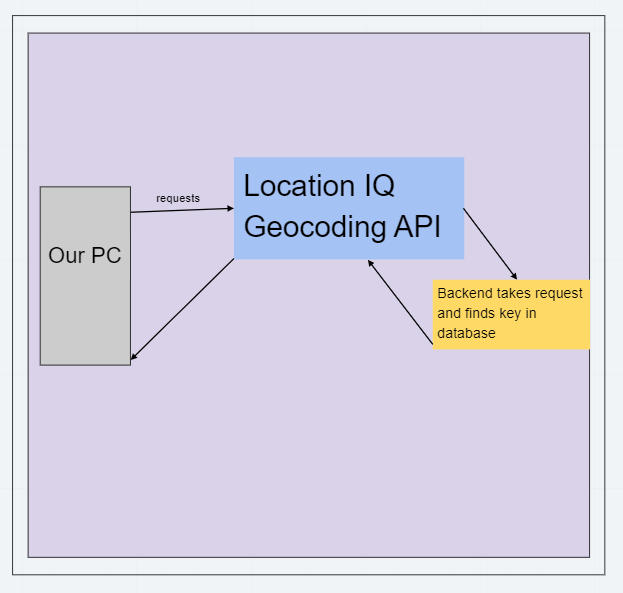
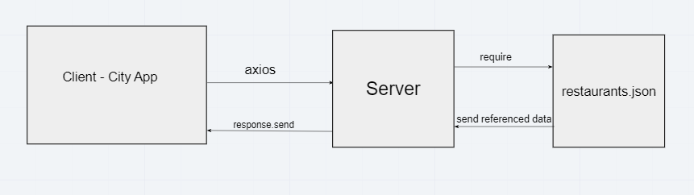
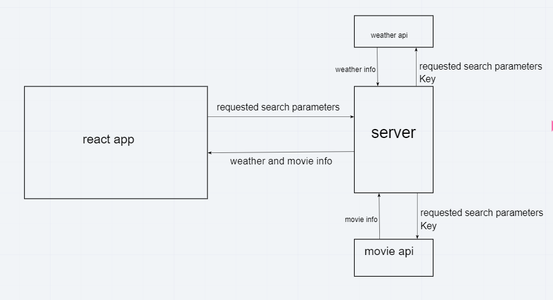

**Author**: Dave Arno
**Bersion**: 1.0.0

## Overview
This application will take in a location, and return the latitude and longitude of said location, as well as provide a map. I'm building it because knowing the forecast is nice.

## Getting Started
1. Get keys for all API's, we use one for location, and one for weather
2. Put a form on your front end that will accept a user input
3. Using your location API key, request a location from your location API
4. Print your location data in an aesthetically pleasing manner
5. Set up a server that will take requests from your front end, request the corresponding data from the desired API, and return it to the front end
6. Send lat/lon to the server to get the forecast data
7. Display returned data.

## Architecture
We have a front end made with React that gets the lat/lon of an inputted location from LocationIQ, and then uses that lat/lon to request data from our server. Our server, made with Node(?), holds our weather API key, and submits a request to the Weatherbit API for forecast data using the lat/lon given by the front end. All of this is done with Javascript.  
<!-- Provide a detailed description of the application design. What technologies (languages, libraries, etc) you're using, and any other relevant design information. -->

## Changelog

## Credit and Collaborations
Day one Partner: [Joel Connel](https://github.com/zgameboyz)
Day two Partner: [Miriam Silva](https://github.com/mirmsilva)
Day three Partner [Shan Jiang](https://github.com/ShanJiang1911)
Day four Partner [Jona Brown](https://github.com/SorviusN)

## Daily Charts

